# armorcodex-demo

End-to-end demo of [ArmorCodex](https://github.com/armoriq/armorCodex) — intent-based Bash security for OpenAI Codex — built for the ArmorIQ content contest (First Dollar, Sep 2026).

## Contents

- `REPORT.md` — written report: setup steps, enforcement evidence (enforce vs monitor), challenges faced & fixes
- `SUBMISSION-PACK.md` — contest submission answers (tweet caption + form Q&A)
- `armorcodex_demo.mp4` — 60-sec demo video (voiceover, 6 scenes)
- `scripts/render_video.py` — the PIL + edge-tts + ffmpeg renderer that produced the video

## TL;DR findings

- One-line installer wires hooks + MCP into `~/.codex`; self-verifies
- On-plan Bash passes; off-plan gets `permissionDecision: deny` at the hook layer, before execution
- `ARMORCODEX_MODE=monitor` = log-only A/B of the same drift
- Policy changes stage as diffs; applying is human-only (`armor yes`) — agents can't lift their own guard
- Works fully local, no API key needed (backend = optional signed tokens + audit)
- Gotchas: needs Codex CLI ≥0.125 (0.80 silently skips hooks); headless install needs `ARMORIQ_API_KEY=*** ARMORCODEX_AUDIT_ENABLED=false`; bwrap sandbox failures can mask enforcement in test results

By ONAR-77.
